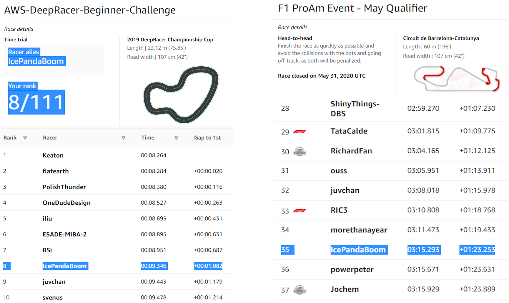
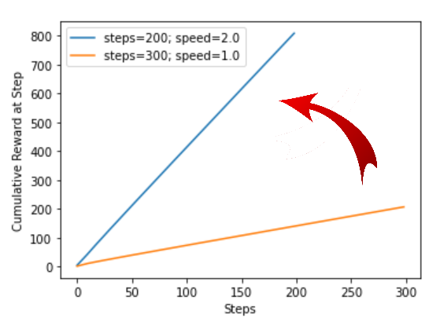

# Getting into the top 10 of AWS Deepracer - May 2020

As a F1 buff, I came across the AWS Deepracer May 2020 promotional event on the official F1 website and couldn't pass on the challenge to pit myself against the ever smiling 7-time F1 race winner Daniel Ricciardo. Which I almost did in the head-to-head challenge. This article chronicles my 2.5 week journey from a complete AWS Deepracer newbie to placing top 10 of the competitive leaderboard. In part 1 of this blog series I'll discuss how I overcame the AWS Deepracer learning curve and present a robust reward function. Part 2 I will be sharing my insights on how to break into the top 10 of the leaderboard by using waypoints, and also quantifying the training using the log analysis tools. 



## Accelerating Through the Learning Curve

After training the Original Deepracer model that everyone starts out with, I realised that to be competitive the model needs speed and stability. Scavenging the internet for any piece of hidden gem that I could uncover, I found the the following was crucial to overcome the steep learning curve in a short period of time: Completing the AWS Deepracer online course, understanding the Deepracer documentation, joining the Deepracer Community, scavenging online for reward function examples, and reading a few eye opening [articles](https://www.alexirpan.com/2018/02/14/rl-hard.html) on reinforcement learning (RL).

In the month of May there were many events running - 3 different race modes and 2 different tracks. From my initial experimentations in model training, I observed that I needed at least 6 hours to train a stable model (which turned out to be an underestimate as more training time is needed for models with higher speed). I made an executive decision early on to only train for the time trials race mode. Also since the Summit Online and Beginner-Challenge events were both run on the reInvent2019 track I opted to put my initial focus on this shorter track.

## Reward Function, Action Space and Hyperparameters

First few days were mainly trial and error. My first major realisation was that rather than the default step function centerline rewards, the reward function needed to be more granular. Due to the random exploration nature of the training, a continuously sloping reward function pushes the model towards the desired behaviour much faster. 

Below is the reward function which I use for model initialisation and getting to the upper quartile of the leaderboard. This reward function firstly promotes the model to be on the centerline. After the first 10 steps, reward is given based on efficient track completion (progress/steps) and speed. Without fixating on the centerline, the model is allowed to explore the track to find a more optimal line by itself (cutting corners, hitting apexes). The plot below with two lines below shows a simplified training behaviour of the reward function. The idea is that since reaching the finish line with smaller number of steps and higher speeds gives it more reward, the model will tend to find an efficient racing line and take it with highest speed possible.

```python
#Optimise for progress
def reward_function(params):

    # Read input variables
    reward = 0.001

    if params["all_wheels_on_track"]:

        if params['steps']<10:
            reward = (1 - (params['distance_from_center'] / (params['track_width']/2))**(4))*params['speed']**2
        if params['steps']>=10:
            reward = ((params['progress']*params['speed']**2)/params['steps'])*2
    else:
        reward = 0.01

    if abs(params['steering_angle']) < 10 and params['speed']==3:
        reward += params['speed']**2/4
    else:
        reward += 0.01

    return float(reward)
````


Action space is also important, as too many possible actions can lead to slow learning. Depending on the track layout, actions such as 30 degree turns may not even be needed. For the reInvent2019 track I opted for a 3-layer-CNN for fast training. Speeds ranges (1,2,3) and Turning angles (-20,0,20). I could have chosen higher Speeds (1.33,1.67,4.0) but the car becomes harder to train and unwieldy due to the sliding physics in the training environment. A 1/18th car model with 4m/s translates to a full sized car with 259km/h. The hyperparameters I found to work the best were: Batch size: 128, Discount factor: 0.995 and everything else kept as is. 

The following quote is quite accurate for my Deepracer journey: "It's useful to imagining deep RL as a demon that's deliberately misinterpreting your reward and actively searching for the laziest possible local optima." For Deepracer this means that for the model finding the best racing line just by random exploration is almost like a monkey with a typewriter eventually writing Shakespeare. The fastest time I found possible with the above set of parameters was 14s for the reInvent2019 track. To get into the top 10 you need under 10s track completions consistently. The only efficient way to achieve this is to delve into the controversial issue of overfitting the model to the track. In the next part of this blog I will sharing how to break into the top 10 with my implementation of the racing line using waypoints and getting sub 10s laptimes.
