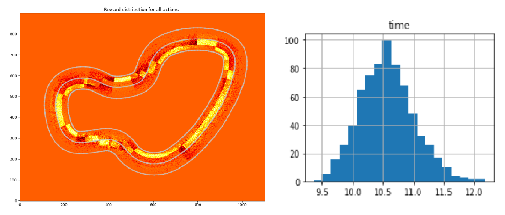
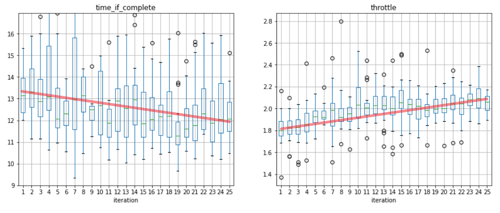

# Part 2: Breaking into the Top 10

This is part 2 of the MickQG's Deepracer blog series. You can find Part 1 __[here](https://mickqg.github.io/DeepracerBlog/)__.

About a week into my Deepracer journey, the  reward function outlined in [Part 1](https://mickqg.github.io/DeepracerBlog/) hit a 14s brick wall in lap times on the reInvent2019 track. My realisation which solved this problem came as a result of knowing a bit of motor racing and watch many many hours of F1. Why don't we create an optimal racing line that trains the car to hit corner apexes and carry as much speed through the corners as possible? Using waypoints seem to be the [current meta](https://youtu.be/Ao6Ppdz-F1I?t=131) to efficiently train for the fastest laptimes.

## Waypoints, Waypoints, Waypoints
 

The gif above shows the process of creating the custom racing line. In brief, the track points (center line, outer border and inner border) are loaded into a Jupyter Notebook. As the track is layed out on an x-y grid, we can create the custom racing line using cursor input. Analysis on the track and racing line can then be performed. My python implementation can be found __[here](https://github.com/MickQG/deepracer-analysis/blob/master/Track_Analysis.ipynb)__.

## Waypoints Reward Function

The racing line is defined by 4 track regions: left, center left, center right and right. The following reward function gives rewards if the model is in the correct track region, and penalises if it is not. Furthermore, for each track point there is also a corresponding speed target for which rewards and penalties are given.

<details>
  <summary><strong>Click to expand reward function</strong></summary>
    
```python
# Racing line using Waypoints
def reward_function(params):
    left = [8,9,10,11,12,13,14,15,
           34,35,36,37,38,39,40,41,42,43,44,45,46,47,48,49,50,51,52,53,54,55,56,
           57,58,59,60,61,62,63,64,65,66,67,68,69,
           85,86,87,88,89,90,91,92,
           139,140,141,142,143,144,145,146,147,148,149,150,151]
    centerleft = [1,2,3,4,5,6,7,
                 16,17,18,
                 31,32,33,
                 70,71,72,73,74,75,76,77,78,79,80,81,82,83,84,
                 93,94,95,96,97,98,99,100,101,102,103,104,105,
                 106,107,108,109,110,111,112,113,114,115,116,
                 137,138,
                 152,153,154]
    centerright = [19,20,21,22,23,
                  26,27,28,29,30,
                  117,118,119,
                  133,134,135,136]
    right = [24,25,
            120,121,122,123,124,125,126,127,128,129,130,131,132]
    
    fast = [2,3,4,
             14,15,16,17,18,19,20,21,22,23,24,25,26,27,28,29,30,31,32,33,
             47,48,49,50,51,52,53,54,55,56,57,58,59,60,61,62,63,64,65,66,67,
             68,69,70,71,72,73,74,75,76,77,78,79,80,
             96,97,98,99,100,101,102,103,104,105,106,107,
             110,111,112,113,114,115,116,117,118,
             123,124,125,126,127,128,129,130,131,132,133,134,135,136,137,138,
             152,153,154]
    medium = [1,5,6,7,8,9,10,11,12,13,
              34,35,36,37,38,39,40,41,42,43,44,45,46,
              81,82,83,
              86,87,88,89,90,91,92,93,94,95,
              108,109,
              119,120,121,122,
              141,142,143,144,145,146,147,148,149,150,151]
    slow = [84,85,139,140]

    closest = params['closest_waypoints']
    nextwaypoint = max(closest[0], closest[1])

    if params['all_wheels_on_track'] == True:
        if (nextwaypoint in centerleft):
            if (params['distance_from_center']/params['track_width'])<=0.25 and 
               (params['is_left_of_center']):
                reward = 14
            elif (params['distance_from_center']/params['track_width'])<=0.25 and 
                 (not params['is_left_of_center']):
                reward = 0
            else:
                reward = -7
                
        elif (nextwaypoint in centerright):
            if (params['distance_from_center']/params['track_width'])<=0.25 and 
               (not params['is_left_of_center']):
                reward = 14
            elif (params['distance_from_center']/params['track_width'])<=0.25 and
                 (params['is_left_of_center']):
                reward = 0
            else:
                reward = -7

        elif (nextwaypoint in left):
            if (params['is_left_of_center']) and 
               (params['distance_from_center']/params['track_width'])>0.25 and
               (params['distance_from_center']/params['track_width'])<0.48:
                reward = 14
            else:
                reward = -7
        elif (nextwaypoint in right):
            if (not params['is_left_of_center']) and
               (params['distance_from_center']/params['track_width'])>0.25 and
               (params['distance_from_center']/params['track_width'])<0.48:
                reward = 14
            else:
                reward = -7

        if nextwaypoint in fast:
            if params['speed'] == 3:
                reward += 14
            else:
                reward -= (5-params['speed'])**2
        elif nextwaypoint in medium:
            if params['speed'] == 2:
                reward += 14
            else:
                reward -= 7
        elif nextwaypoint in slow:
            if params['speed'] == 1:
                reward += 14
            else:
                reward -= (2+params['speed'])**2
                
    else:
        reward = 0.01
    
    return float(reward)
```
</details>
    
## Log Analysis - Deeper into the Rabbit Hole

The general adage of deliberate practice - to practice systematically and purposefully - does also apply to RL. In our case we want to confirm the action space is suitable for the track and reward function is incentivising the right behaviour. The log analysis tool is vital in understanding your trained model. It has much more detail than graphs in the online training console. Many thanks to Tomasz (Breadcentric) Ptak for maintaining the notebook and making it accessibe through his [blog](https://blog.deepracing.io/2020/03/30/introducing-aws-deepracer-log-analysis/) and [github repo](https://github.com/aws-deepracer-community/deepracer-analysis).



To showcase the power of this log analysis tool, the above two graphs show important metrics that I use to quantify my model. Left plot is the distribution of rewards given on each point of the track. Yellow is positive and red is negative reward. This reward distribution corresponds to the waypoint reward function described in the previous section. Right is the distribution of completed lap times. This corresponds quite well to the times that you can expect when submitting to the leaderboard.



Furthermore, I modified and included a few new plots to analyse model's behaviour. Left is a box plot view of completed lap times for each iteration, and right is the box plot of average throttle (speed) values for each iteration. The trend above shows good convergence as lap times decrease and throttle values increase over the training period.

## Further Work

In the month of May I racked up \$2000 worth of fees training online using the AWS Deepracer console. It would be prohibitively expensive to train your model like this in future months as the promotional event ended at the end of May 2020. One option is to set up [local training](https://wiki.deepracing.io/Local_Training) on a spare home machine.

Implementation of the racing line can also be improved. Automatically generated racing line taking into account of action space parameters could be possibly done using Bresenham's line algorithm.
